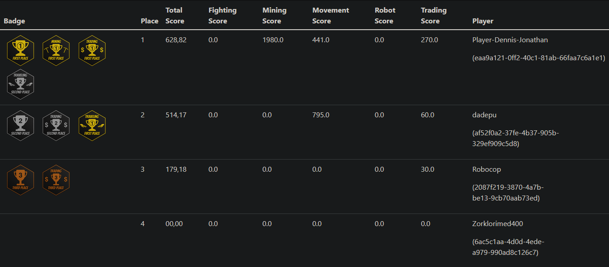
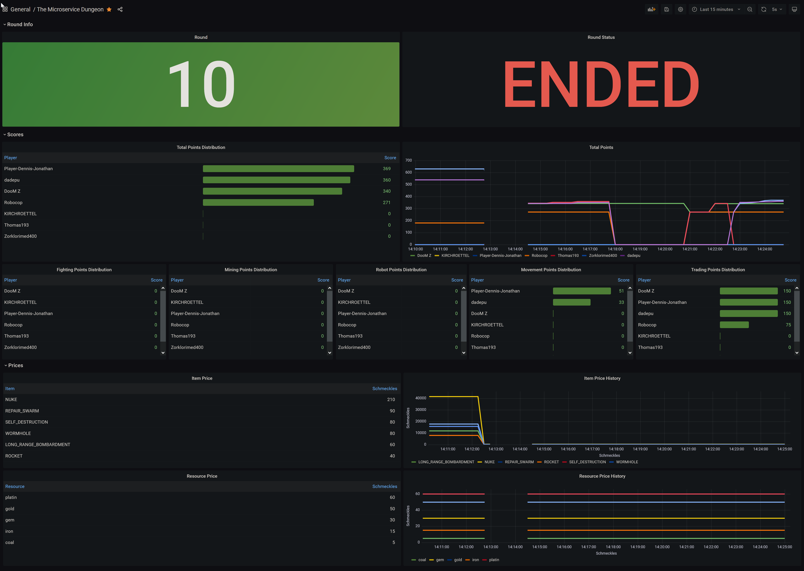

# gamelog

## Running this service

### Prerequisites

To run this service and its dependencies, the following things need to be installed:
- Docker and Docker Compose (for the Kafka and MariaDB containers required for development)
- Java in version 17 or newer
- Maven (manages the dependencies, building and execution of the Java project)

### Starting the service
First, start the Kafka and MariaDB Docker containers via Terminal (run this in the base directory of the project):
```shell
docker-compose -f src/main/docker/docker-compose.kafka.yml up -d
docker-compose -f src/main/docker/docker-compose.mariadb.yml up -d
```
This will download the required images (if they aren't found locally) and start the containers in detached mode.

As soon as both containers are running, you can start the Java application via Terminal (run this in the base directory of the project):
```shell
mvn spring-boot:run
```
This will compile the project and start the application.

### Grafana / Prometheus

We configured a Grafana Dashboard for displaying game-related metrics and some score values. The 
necessary configuration files are found in this repo as well ([Prometheus](./src/main/prometheus), [Grafana](./src/main/grafana)).

## Documentation

### Decision Log
An overview of our decisions can be found [here](https://the-microservice-dungeon.github.io/decisionlog/services/gameLog.html) on the Microservice Dungeon Decision Log.

### API Documentation
Our API Documentation can be found [here(REST API)](https://raw.githubusercontent.com/The-Microservice-Dungeon/gamelog/main/docs/api-spec.yaml) and [here(Event Specification)](https://raw.githubusercontent.com/The-Microservice-Dungeon/gamelog/main/docs/event-spec.yaml).

### Wiki
Further documentation can be found on the [wiki](https://github.com/The-Microservice-Dungeon/gamelog/wiki), including [Problems and Conclusions for further Development](https://github.com/The-Microservice-Dungeon/gamelog/wiki/Problems---Conclusions---Future-Development),
the [Scoreboard Mechanics](https://github.com/The-Microservice-Dungeon/gamelog/wiki/Scoreboard-mechanics), the [Concept of the Service](https://github.com/The-Microservice-Dungeon/gamelog/wiki/Service) and the list of [Trophies and Achievements](https://github.com/The-Microservice-Dungeon/gamelog/wiki/Trophies).

## Features
This microservice provides scoreboards and trophies for the players of the Microservice Dungeon.

### Scoreboard
The service provides a scoreboard for the total scores of the players. Whoever ranks no. 1 on this board can be considered the winner of the game.

The service also provides categorized scoreboards in 4 categories to enable competing in different aspects of the game. Those categories are:
- Fighting
- Mining
- Robot Stats
- Trading
- Traveling

The scoreboard is reachable under the `/scorebard` endpoint as defined in the [API Spec](docs/api-spec.yaml). 
However, if you call it from the browser it will render a static view of the scoreboard. 



### Grafana Dashboard

We developed a Grafana Dashboard to provide various metrics including scores to the participants of 
the codefight/hackathon. 



### Achievements and Trophies

The service provides achievements and trophies.  
Achievements are awarded for the individual progress of the player in activities of the game.  
Trophies are awarded to the players that rank 1st, 2nd and 3rd on any of the scoreboards.

#### Achievements

| Category / Level | Bronze                                                                                                                                                                          | Silver                                                                                                                                                                           | Gold                                                                                                                                                                                 |
|------------------|---------------------------------------------------------------------------------------------------------------------------------------------------------------------------------|----------------------------------------------------------------------------------------------------------------------------------------------------------------------------------|--------------------------------------------------------------------------------------------------------------------------------------------------------------------------------------|  
| Fighting         |  |  |            |  
| Mining           |            |     |  |  
Trading          |     |          |          |  
| Traveling        |       |    |           |    

#### Trophies

|Scoreboard / Rank|Third Place|Second Place|First Place|  
|---------------|-|-|-|  
|Game| | |        |  
|Fighting| | |    |  
|Mining| | |      |  
|Trading| | |     |  
|Traveling| | |   |

#### Copyright of the graphics
Copyright (c) André Hahn, 2022. Licensed under the Terms and Conditions of the Creative Commons CC BY-NC license.